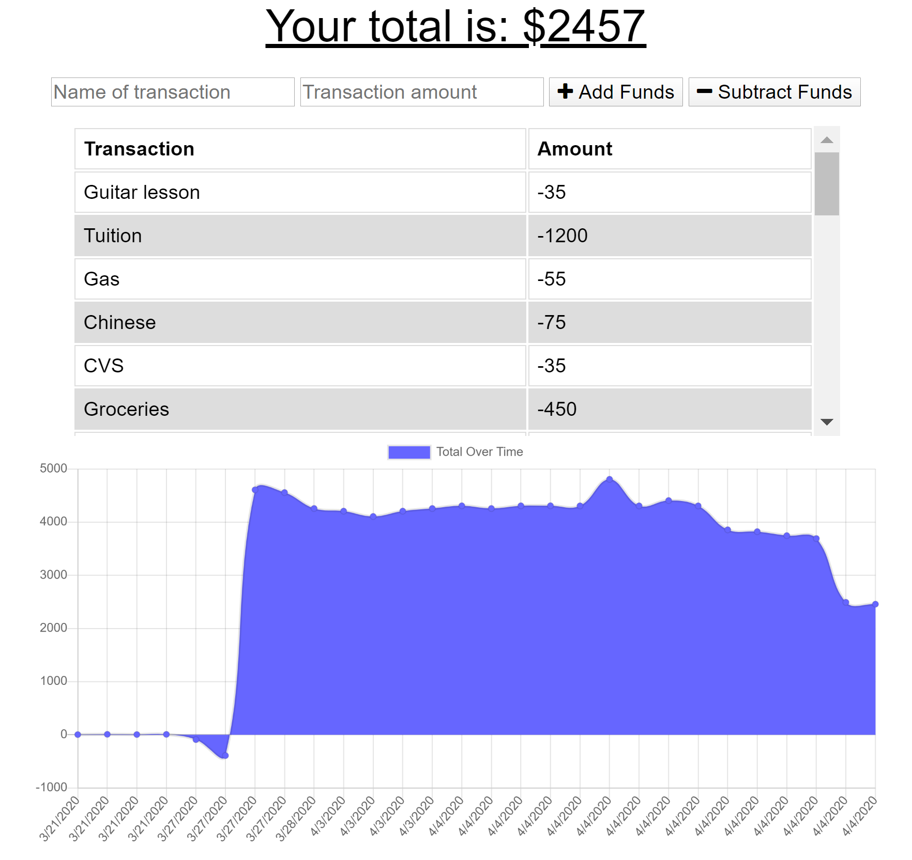

# UPenn-Week-18-Homework-BudgetTracker

# Purpose

Users want to be able to keep track of their debits and credits transactions with the ability to use the app online as well as offline. Budget Tracker is here to provide simple platform for anyone to keep a log of their activities.

# Usage

Users will create a entry by entering a name for the transaction, the amount of the transaction, then they will click either Add or Subtract to save the transaction.

# Screenshot

# Live site 

https://ispenthowmuch.herokuapp.com/

# GitHub Repo

https://github.com/tdj03001/UPenn-Week-18-Homework-BudgetTracker

